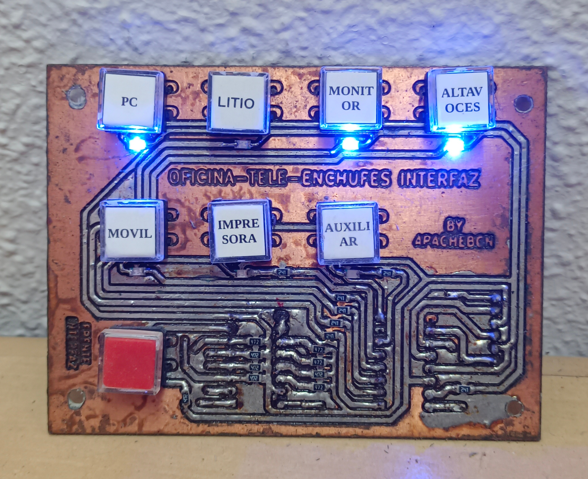

# apachebcn_oficina_tele_enchufes

Control remoto de enchufes, pensado para la oficina para encender y apagar fácilmente todos los dispositivos.
Incluye proyecto de Kicad para fabricar las placas.

El proyecto consta de 2 placas pcbs.
1 pcb para conectar el arduino a los relés. (yo lo tengo debajo de la mesa, porque no es necesario tener acceso nivisibilidad a esta placa)
1 pcb de interfaz donde están los pulsadores para activar/desactivar los relés, y leds de testigos para saber que relés están encendidos.

Foto de pcb de la interfaz:

Foto de pcb de los relés:

